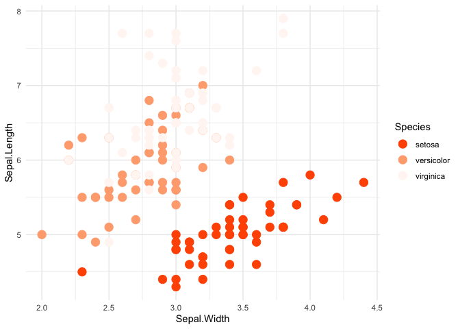
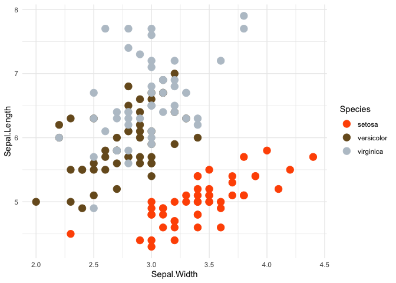
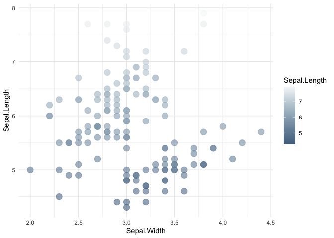
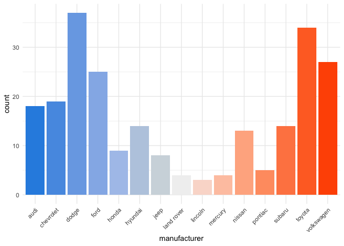

<!-- README.md is generated from README.Rmd. Please edit that file -->

# DataRobotColors

<!-- badges: start -->
<!-- badges: end -->

The goal of DataRobotColors is to allow users to bring the DataRobot
color schemes in to R plots and specifically {ggplo2}. The main
functions of this package are `scale_color_DataRobot()` and
`scale_fill_DataRobot()`. Additionally, the `DataRobot_pal()` function
returns a `pal` function that can be used in other R plotting functions.
Helper functions include `DataRobot_palette_names()` to name the
palettes available, and `DataRobot_get_palettes()` to return the hex
values of the underlying palette.

## Installation

You can install the development version of DataRobotColors from
[GitHub](https://github.com/) with:

``` r
# install.packages("devtools")
devtools::install_github("mrecos/DataRobotColors")
```

## Example

This is a basic example which shows you how to solve a common problem:

``` r
library(DataRobotColors)
library(ggplot2)
theme_set(theme_minimal())
```

What is special about using `README.Rmd` instead of just `README.md`?
You can include R chunks like so:

``` r
ggplot(iris, aes(Sepal.Width, Sepal.Length, color = Species)) +
  geom_point(size = 4) +
  scale_color_DataRobot()
```


``` r
ggplot(iris, aes(Sepal.Width, Sepal.Length, color = Species)) +
  geom_point(size = 4) +
  scale_color_DataRobot(palette = "DR_Reds")
```



``` r
ggplot(iris, aes(Sepal.Width, Sepal.Length, color = Species)) +
  geom_point(size = 4) +
  scale_color_DataRobot(palette = "DR_Qualitative")
```



``` r
ggplot(iris, aes(Sepal.Width, Sepal.Length, color = Sepal.Length)) +
  geom_point(size = 4, alpha = .6) +
  scale_color_DataRobot(discrete = FALSE, palette = "DR_Grays")
```



``` r
ggplot(mpg, aes(manufacturer, fill = manufacturer)) +
  geom_bar() +
  theme(axis.text.x = element_text(angle = 45, hjust = 1)) +
  scale_fill_DataRobot(palette = "DR_Diverging", guide = "none")
```


