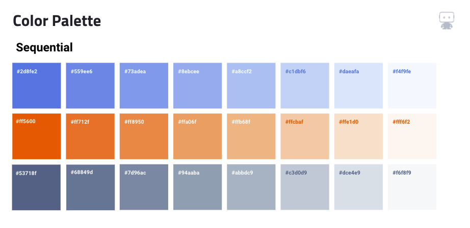
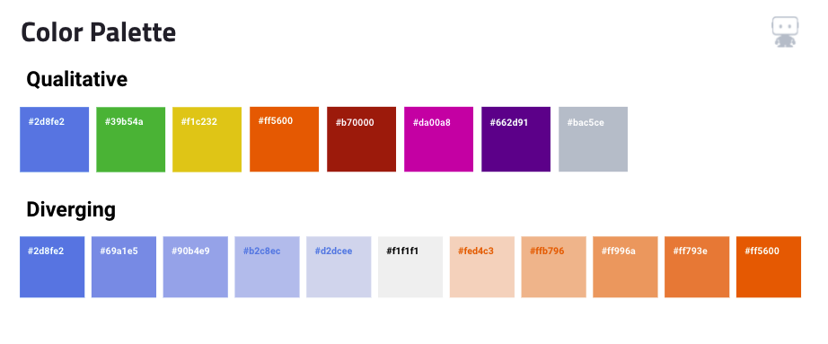
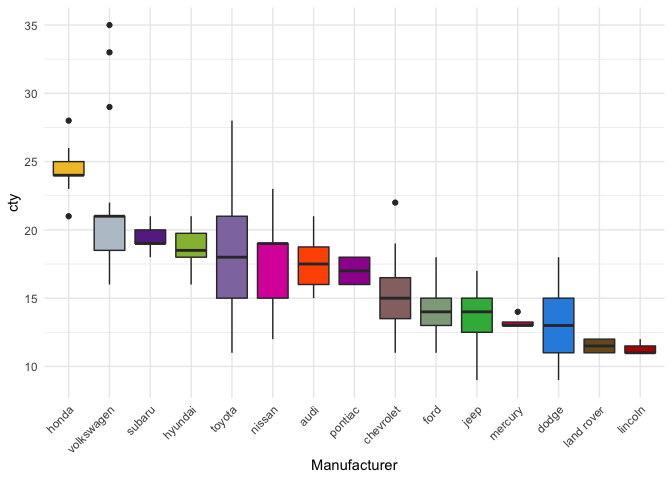
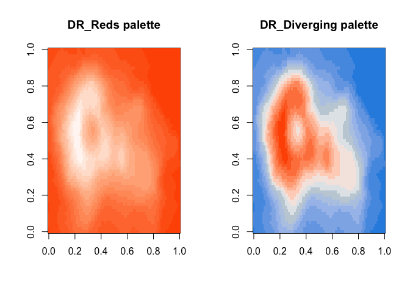

<!-- README.md is generated from README.Rmd. Please edit that file -->

# DataRobotColors

<!-- badges: start -->
<!-- badges: end -->

The goal of DataRobotColors is to allow users to bring the DataRobot
color schemes in to R plots and specifically {ggplo2}. The main
functions of this package are `scale_color_DataRobot()` and
`scale_fill_DataRobot()`. Additionally, the `DataRobot_pal()` function
returns a `pal` function that can be used in other R plotting functions.
Helper functions include `DataRobot_palette_names()` to name the
palettes available, and `DataRobot_get_palettes()` to return the hex
values of the underlying palette.

Palettes include:

-   DR_Reds
-   DR_Blues
-   DR_Grays
-   DR_Diverging
-   DR_Qualitative

## Installation

You can install the development version of DataRobotColors from
[GitHub](https://github.com/) with:

``` r
# install.packages("devtools")
devtools::install_github("mrecos/DataRobotColors")
```

## DataRobot Palettes





## {ggplot2} Examples

``` r
library(DataRobotColors)
library(ggplot2)
theme_set(theme_minimal())
```

``` r
# Default is `DR_Blues`
ggplot(iris, aes(Sepal.Width, Sepal.Length, color = Species)) +
  geom_point(size = 4) +
  scale_color_DataRobot()
```


``` r
ggplot(iris, aes(Sepal.Width, Sepal.Length, color = Species)) +
  geom_point(size = 4) +
  scale_color_DataRobot(palette = "DR_Reds")
```


``` r
ggplot(iris, aes(Sepal.Width, Sepal.Length, color = Sepal.Length)) +
  geom_point(size = 4, alpha = .6) +
  scale_color_DataRobot(discrete = FALSE, palette = "DR_Grays")
```


``` r
ggplot(mpg, aes(manufacturer, fill = manufacturer)) +
  geom_bar() +
  theme(axis.text.x = element_text(angle = 45, hjust = 1)) +
  scale_fill_DataRobot(palette = "DR_Diverging", guide = "none")
```


``` r
ggplot(mpg, aes(reorder(manufacturer, -cty), 
                y = cty, fill = manufacturer)) +
  geom_boxplot() +
  labs(x = "Manufacturer") +
  theme(axis.text.x = element_text(angle = 45, hjust = 1)) +
  scale_fill_DataRobot(palette = "DR_Qualitative", guide = "none")
```



``` r
ggplot(iris, aes(Sepal.Width, Sepal.Length, color = Species)) +
  geom_point(size = 4) +
  scale_color_DataRobot(palette = "DR_Qualitative")
```


## R Base plot Examples

``` r
library(DataRobotColors)
new_DR_Reds_pal <- DataRobot_pal("DR_Reds")
new_DR_Diverging_pal <- DataRobot_pal("DR_Diverging")
```

``` r
par(mfrow = c(1, 2))
image(volcano, 
      col = new_DR_Reds_pal(16), 
      main = "DR_Reds palette")
image(volcano, 
      col = new_DR_Diverging_pal(16), 
      main = "DR_Diverging palette")
```



## Leaflet Examples (TBD)
